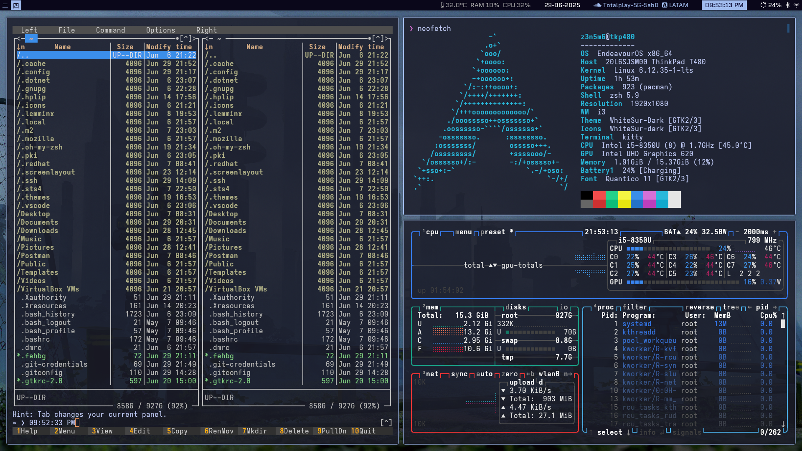
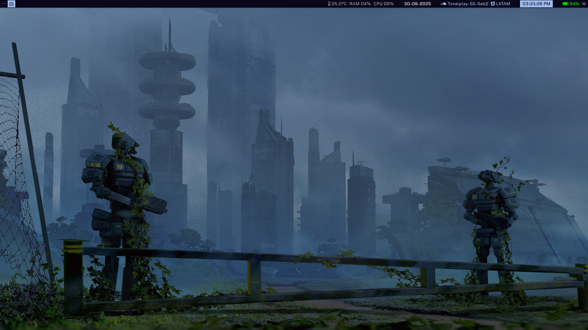
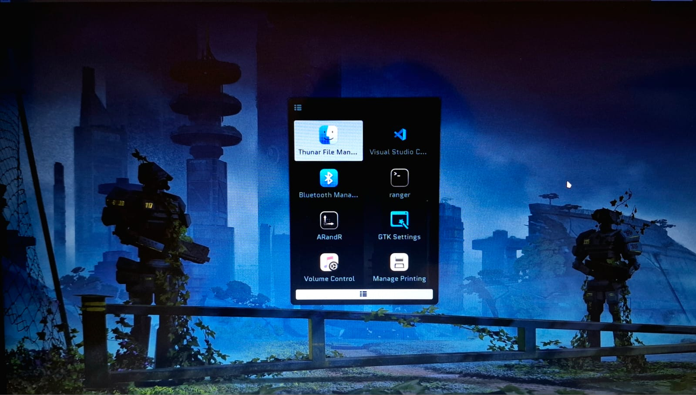
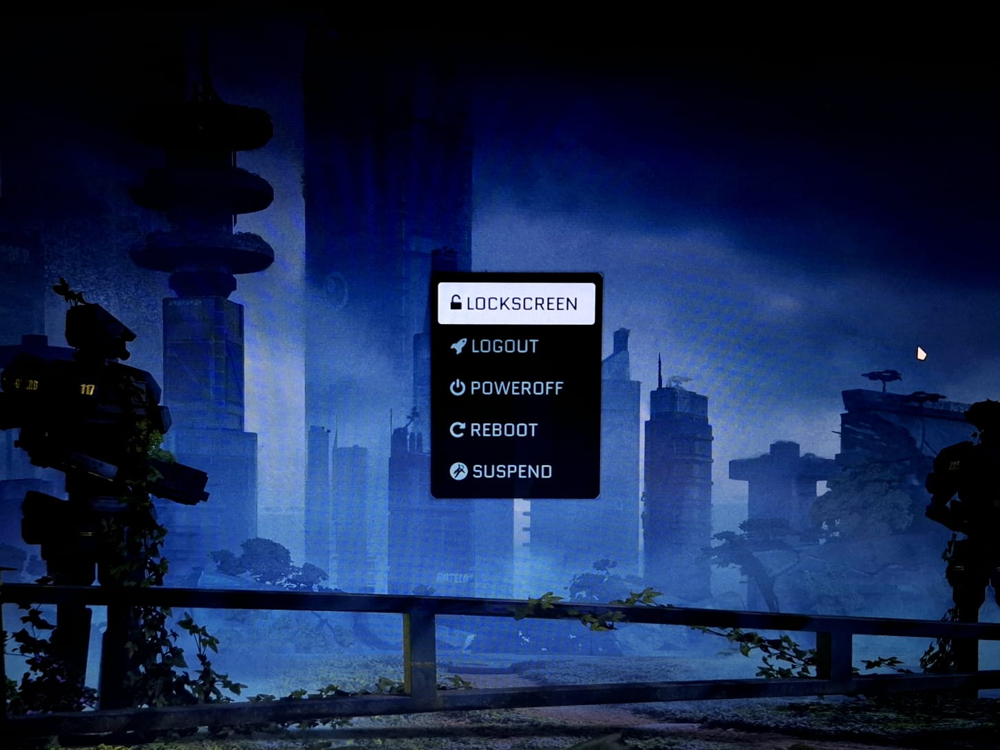
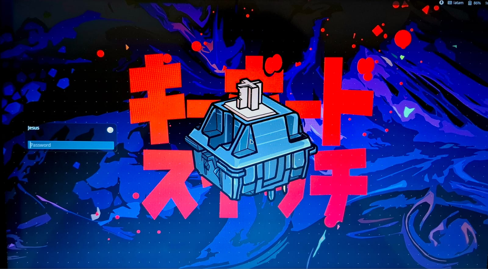

# ❄️ Minimalismo Funcional con i3WM

¡Bienvenido/a! Este repositorio contiene mi configuración personalizada de **i3 Window Manager**, con un enfoque **minimalista**, **visualmente frío** y pensado especialmente para quienes **están comenzando** en el mundo de la personalización en Linux.

> ⚠️ Este proyecto no pretende imponer un estilo, sino guiarte y ayudarte a construir el tuyo propio.

---

## 🌱 ¿Por qué esta configuración?

- **Ligereza + control:** Uso **EndeavourOS**, una base Arch más accesible, para tener control sin armar todo desde cero.
- **Estética fría:** Elegí **colores fríos** por gusto visual, menor fatiga ocular y buen contraste entre elementos.
- **Inicio amigable:** Lo más complejo al principio fue entender los **atajos de teclado**, por eso esta guía pone énfasis en eso.
- **Diseño gradual:** Comencé actualizando el sistema, seleccionando paletas y adaptando cada componente según mis necesidades diarias.

---

## 🛠️ Primeros Pasos: Preparar el Sistema

### 1. Actualiza tu sistema
```bash
sudo pacman -Syu
```

### 2. Instala un AUR helper (si no tienes uno)

```bash
sudo pacman -S --needed base-devel git
git clone https://aur.archlinux.org/yay.git
cd yay
makepkg -si
```

### 3. Instala las aplicaciones recomendadas

```bash
# Terminal y shell
yay -S kitty zsh

# Personalización
yay -S picom feh redshift dunst rofi betterlockscreen \
lightdm-slick-greeter ttf-nerd-fonts-symbols ttf-nerd-fonts-symbols-common

# Productividad
yay -S code postman onlyoffice-bin ranger mc btop

# Tema y fuentes (opcional)
yay -S whitesur-gtk-theme whitesur-icon-theme ttf-quantico

```

###	4. Cambia tu shell a zsh

```bash
chsh -s /bin/zsh
```

###	5. Aplica los archivos de configuración

```bash
cp -r i3-config ~/.config/i3

cp picom/picom.conf ~/.config/picom/

cp gtk-setting/xsettingsd.conf ~/.xsettingsd

# Repite con las demás carpetas...

```

##	📁 Estructura del Repositorio

```bash
.
├── gtk-setting/            # Configuración de temas GTK
├── i3-config/              # Configuración i3 e i3blocks
├── lock-screen/            # slick-greeter para login
├── notify/                 # Configuración de Dunst
├── picom/                  # Transparencias y composición
├── redshift/               # Temperatura de color en pantalla
├── rofi/                   # Temas y configuración
├── screenshot/             # Capturas del entorno
├── terminal/               # kitty.conf
└── wallpapers/             # Fondos de pantalla

```

⚙️ Detalles Técnicos

- Distribución: EndeavourOS x86_64
- Host: ThinkPad T480
- Kernel: Linux 6.12.35-1-lts
- WM: i3
- Shell: Zsh + Powerlevel10k
- Terminal: Kitty
- Tema GTK: WhiteSur-Dark
- Iconos: WhiteSur-dark
- Fuente: Quantico 11
- Resolución: 1920x1080
- CPU/GPU: Intel i5-8350U / UHD Graphics 620
- RAM: 15.37 GiB

## 🖼️ Vista Previa del Escritorio


### Escritorio

<table>
  <tr>
    <td align="center">
      
      <p>Escritorio de Multi-Ventanas</p>
    </td>
    <td align="center">
      
      <p>Escritorio Vista</p>
    </td>
  </tr>
</table>

---

### Rofi y Selector de Tareas

<table>
  <tr>
    <td align="center">
      
      <p>Rofi launcher (Dmenu)</p>
    </td>
    <td align="center">
      
      <p>Rofi Powermenu</p>
    </td>
  </tr>
</table>

---

### Pantalla de Bloqueo

<table>
  <tr>
    <td align="center">
      
      <p>Bloqueo de Inicio de Sesión (dm-tool lock)</p>
    </td>
    <td align="center">
      
      <p>Bloqueo de Suspensión (betterlockscreen -l)</p>
    </td>
  </tr>
</table>

---

##	🧠 Tips para Principiantes

- Lee cada sección del README, no necesitas aplicar todo de golpe.

- Ajusta los atajos a tus hábitos.

- Prueba una cosa a la vez: cambia fondo, tema, luego barra, luego scripts.

- No necesitas saberlo todo para disfrutar tu escritorio.

##	📸 Nota sobre los Fondos de Pantalla

Las imágenes en wallpapers/ no son de mi autoría. Se incluyen solo con fines educativos y demostrativos, sin fines de lucro. Si eres el autor y deseas que se retiren, por favor contáctame.

##	✨ Créditos y Licencia

Este proyecto está compartido de forma libre para quien quiera aprender o inspirarse. Siéntete libre de copiar, adaptar y compartir — solo no olvides dar crédito si te parece justo.

> ¡Gracias por visitar este proyecto! Espero que sea tu primer paso para crear tu propio espacio minimalista con i3.
